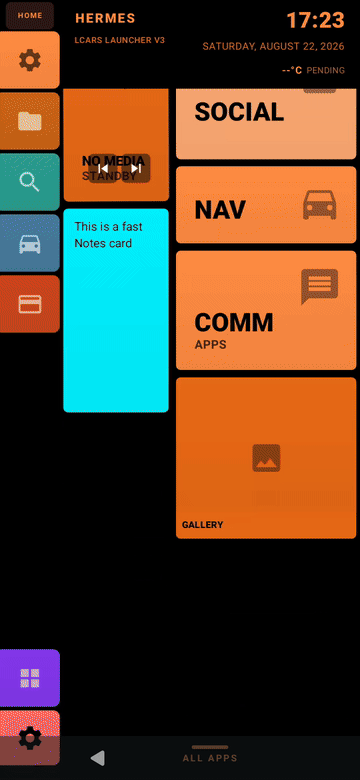

# Omni-Terminal: Unified Search

Omni-Terminal is GT-Launcher's search layer — it lives inside the **App Drawer** and opens the moment you start typing there, or via the sidebar's **Search** button. One query fans out across every source the launcher knows about and comes back as a single, categorized results list.

## 🔍 What It Searches

Type a query and Omni-Terminal checks, in parallel:

| Category | What it finds |
|---|---|
| **Calc** | Inline math — type an expression, get the answer as a result card |
| **Top Result / Apps** | Your installed apps, ranked by match quality |
| **Contacts** | Matching contacts, shown with photo and one-tap Call/SMS |
| **Calendar** | Upcoming events matching your query |
| **Media** | Music/media search shortcuts routed to your default player |
| **System** | Launcher and Android Settings screens (e.g. searching "wifi" surfaces the WiFi settings shortcut directly) |
| **Web** | Web search, Google Maps, and Play Store lookups as single-tap actions |
| **AI** | AI-assisted results, where enabled |

Which sources are active, and how they're presented, is configurable from **Engineering → SIDEBAR → SEARCH** (basic controls: density, style, icons; advanced controls: which sources run and how aggressively they debounce).

## 📡 Smart Result Cards

Results aren't plain text rows — they're interactive GT cards:
- **Contact results** show a photo and one-tap Call/SMS buttons.
- **App results** support long-press for context actions like Uninstall.
- **Calc results** show the computed value with a Copy-to-Clipboard action.
- **System/Web results** open their exact destination directly — no intermediate chooser dialog.

Results, category labels, and calendar-date formatting all follow your app's selected language, not just the device locale.

---
*Tip: dragging on any result dismisses the keyboard, so scrolling through a long result list never fights with the IME.*
