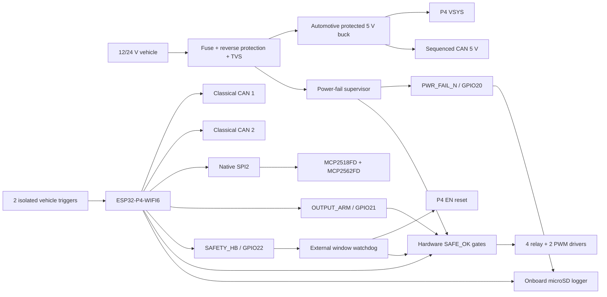

# UniControl V2 Ironclad Design Review

## Verdict

The V2 Core pin plan is electrically coherent after the R2 corrections, but
the hardware is not yet release-to-fabrication. The GPIO map itself has no
known collision: USB and strapping pins are protected, native SPI2 is used for
CAN FD, both Classical CAN ports have independent standby control, and all 27
header GPIOs are intentionally assigned or reserved.

The largest remaining risks are not GPIO count. They are vehicle power
transients, unknown output loads, SD power-loss behavior, devkit/display
mechanics, component/PCB qualification, and the still-V1 firmware HAL.

## R2 Corrections That Must Not Be Reverted

1. CAN FD SPI is `GPIO28=CS`, `GPIO29=MOSI/SDI`, `GPIO30=SCK`,
   `GPIO31=MISO/SDO`, `GPIO32=INT`. The earlier SCK/MISO/CS order did not match
   the ESP32-P4 native SPI2 IO_MUX.
2. `GPIO33=CAN1_STB` and `GPIO52=CAN2_STB`. Sharing one standby line would save
   a pin but would prevent independent containment and bring-up.
3. `GPIO20=PWR_FAIL_N`. A logging system needs an early hardware warning before
   the 5 V rail dies; brownout detection after collapse is too late for SD sync.
4. `GPIO21=OUTPUT_ARM` and `GPIO22=SAFETY_HB`. The pull-down arm net prevents
   early output enable; a TPS3430-Q1 window watchdog resets the P4 and gates all
   relay/PWM commands OFF if the heartbeat is too early, late, or missing.
5. Use one solid electrical ground plane. High-current output returns are
   separated by placement and routing, not by cutting the digital reference
   plane.
6. The Core no longer promises LIN or K-Line without a variant/expansion device.
   Safety nets are not repurposed to preserve a feature-list checkbox.

## Architecture and Safety Containment

The intended fault boundary is simple: communication faults remain inside one
port; output faults remain inside one fused/protected channel; CPU/watchdog or
power faults force all physical outputs OFF; a carrier option must not be able
to hold the onboard touch/audio I2C bus low.

## Pin Integrity Audit

| Constraint | Result | Design consequence |
|---|---|---|
| ESP32-P4 strapping GPIO34-38 | Clear | No carrier connection |
| USB OTG GPIO24/25 | Clear | Service USB retained; never vehicle I/O |
| Native SPI2 GPIO28-31 | Corrected | Short, deterministic MCP2518FD link |
| Board I2C GPIO7/8 | Shared | Carrier pull-ups DNP; DNP options must not hang bus |
| Classical CAN controllers | Two native TWAI pairs | GPIO-matrix routing is acceptable for TX/RX |
| CAN standby | Independent | One failed/unused bus can be isolated |
| Safety/power warning | Dedicated | Power fail, output arm, and watchdog use GPIO20-22 |
| Remaining spare GPIO | GPIO23 DNP/AUX | Core needs no expander; bus options need a variant |

## Failure-Mode Review

| Fault | Required hardware response | Verification |
|---|---|---|
| P4 reset/unplugged | CAN standby; relay/PWM OFF | Scope pins during power cycle and reset loop |
| Firmware stalls/runs too fast | TPS3430-Q1 pulses `WDOG_OK` low, resets P4, gates outputs OFF | Stop or overclock heartbeat under load |
| Vehicle power removed | `PWR_FAIL_N` falls early; outputs OFF; bounded SD sync completes | Repeated pull test during maximum logging |
| USB and vehicle power together | No VBUS/VSYS/3V3 back-feed | Measure rail current in every power combination |
| One CAN harness shorted | Other CAN ports and MCU continue operating | CANH/L short-to-ground/battery fault test |
| CAN FD clock/SPI corruption | CRC/error counter increments; controller fails passive | Inject SPI noise/rate stress; verify recovery |
| Output short/overtemperature | Channel protection/fuse acts before PCB/harness damage | Hot short and locked-rotor tests |
| External I2C option stuck low | Onboard touch/audio remain recoverable | Option unpowered/stuck-SDA/SCL fault injection |
| Optocoupler CTR degradation | Valid detection at 9 V, hot/cold, aged minimum CTR | Corner calculation plus chamber test |
| Header vibration/fretting | No intermittent reset or bus activity | Retained assembly vibration test |

## System Bottlenecks

### 1. Devkit and 4.3-inch display identity

The base board documentation lists a two-lane MIPI-DSI interface, but the exact
4.3-inch product, cable pinout, backlight current, mounting, and touch interface
must match the purchased SKU. The devkit/header assembly is a development
platform, not automatically an automotive-qualified ECU module.

### 2. Power stage and shutdown energy

The display/P4 current peak determines buck, connector, copper, and hold-up
size. The simple capacitor relation is:

`C >= I_shutdown * t_sync / allowed_voltage_droop`

Use measured shutdown current after immediately disabling backlight and
outputs. If the result is impractical, isolate the logger rail or change the
logging strategy; do not hide the problem behind an oversized nominal buck.

### 3. Output definition

"Relay" and "MOSFET" are not load specifications. Until current, inrush,
inductance, PWM frequency, ambient, wire, fuse, and fault behavior are known,
the exact driver and connector cannot be safely selected. The V1 G6K telecom
relay and IRFZ44N-style MOSFETs are not blanket substitutes for automotive
power outputs.

### 4. CAN FD controller path

MCP2518FD has a finite 2 KB message RAM and the SPI link must service it under
display, Wi-Fi, and SD load. Use its active-low interrupt, SPI CRC commands,
bounded high-priority queues, and a dedicated task/core policy. Never poll CAN
FD from the UI loop. Overflow, bus-off, and error counters must be logged.

### 5. microSD latency and corruption window

SD writes have long-tail latency. Use a RAM ring buffer, preallocated/fixed-size
files, periodic `f_sync`, record CRC/sequence numbers, and a power-fail flush.
The acceptance criterion is a measured maximum lost interval, not "the file
usually opens."

### 6. Shared onboard I2C

GPIO7/GPIO8 already serve touch/audio and have 2.2k board pull-ups. ADS1115/RTC
are DNP and must remain local. If a carrier option can be unplugged or powered
separately, add a bus-isolation switch/hot-swap buffer so it cannot disable the
HMI by holding SDA/SCL low.

## Firmware Scheduling Contract

### Current repository gap

The current firmware must not be flashed onto V2 as-is:

- `platformio.ini` still targets `esp32-s3-devkitc-1`.
- `src/defs.h` describes the V1 single-CAN/Nextion/external-SD/3+3-output map;
  `include/defs.h` contains a second, conflicting pin-definition set.
- `hal_init_twai()` starts one bus directly in normal/transmit mode.
- There is no second TWAI instance, MCP2518FD driver, TPS3430 heartbeat/arm
  state machine, PWR_FAIL handler, onboard display/SD HAL, or bounded log queue.

V2 therefore needs a distinct board configuration and HAL. Delete the duplicate
pin source of truth, generate all GPIO constants from the reviewed matrix, and
make listen-only plus `OUTPUT_ARM=0` the only boot state. Hardware release and
firmware V2 migration are parallel P0 tracks; neither validates the other.

### Runtime priority contract

Priority order during overload:

1. Power-fail ISR, watchdog, and physical-output safe state.
2. CAN/TWAI and MCP2518FD receive service; never block on SD or UI.
3. RAM log queue and loss counters.
4. SD writer with bounded batches.
5. HMI/audio rendering.
6. Web/Wi-Fi diagnostics and OTA.

No queue may wait forever. When storage or UI falls behind, the system drops or
degrades those consumers explicitly while preserving bus receive and safe
outputs. Every drop has a counter and timestamp.

## Hardware Release Sequence

1. Freeze the exact display/devkit SKU, vehicle transient profile, and load
   table.
2. Create the ESP32-P4 build target and V2 HAL; remove the duplicate V1 pin
   headers and add automated pin-map assertions/tests.
3. Select qualified parts and calculate power, thermal, CAN termination, clock,
   trigger CTR, fuses, creepage, and connector derating.
4. Capture the reviewed KiCad schematic using `v2-pinout.md` and
   `v2-carrier-schematic.md`; run ERC with no unexplained suppressions.
5. Review placement/return-current paths before routing, then review CAN FD,
   crystal, surge, and output loops after routing.
6. Build a current-limited bench prototype; bring up power and safety gates
   before fitting the P4, then CAN listen-only, triggers, outputs with dummy
   loads, and finally full HMI/logging.
7. Execute the fault-injection matrix before installing on a vehicle.
8. Only after electrical, thermal, EMC/transient, vibration, and software stress
   results pass may the design be labeled a production candidate.

## Primary References

- [Waveshare ESP32-P4-WIFI6 documentation](https://docs.waveshare.com/ESP32-P4-WIFI6)
- [Espressif ESP32-P4 datasheet](https://www.espressif.com/sites/default/files/documentation/esp32-p4_datasheet_en.pdf)
- [Microchip MCP2518FD datasheet](https://ww1.microchip.com/downloads/aemDocuments/documents/OTH/ProductDocuments/DataSheets/External-CAN-FD-Controller-with-SPI-Interface-DS20006027B.pdf)
- [Microchip MCP2562FD product/data sheet](https://www.microchip.com/en-us/product/mcp2562fd)
- [TI TCAN1042HGV-Q1 product/data sheet](https://www.ti.com/product/TCAN1042HGV-Q1)
- [TI TPS3430-Q1 window watchdog](https://www.ti.com/product/TPS3430-Q1)
